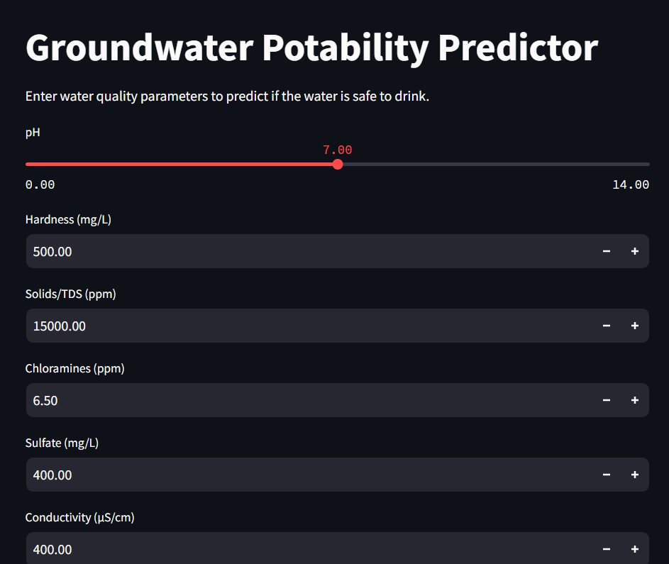

# 💧 Groundwater Potability Prediction

A machine learning web app that predicts whether a water sample is **safe to drink** based on physicochemical measurements.

> Try it live → [https://groundwater-potability-prediction-vfw6dng2k6gayzhvefmfuj.streamlit.app/]

---

## Overview

Access to safe drinking water remains a critical global challenge. This project uses a **tuned Random Forest classifier** trained on water quality data to classify samples as potable or not — providing a fast, data-driven alternative to lengthy lab testing pipelines.

---

## Demo



---

## Features

- Input 9 water quality parameters and get an instant prediction
- Displays confidence score alongside the result
- Handles real-world data issues (missing values, class imbalance)
- Lightweight and deployable on Streamlit Cloud

---

## Installation

```bash
git clone https://github.com/your-username/groundwater-potability.git
cd groundwater-potability
pip install -r requirements.txt
```

**requirements.txt**
```
pandas
numpy
scikit-learn
imbalanced-learn
xgboost
streamlit
joblib
```

---

## Usage

```bash
streamlit run app.py
```

Open `http://localhost:8501`, enter your water sample values, and hit **Predict**.

---

## Project Files

```
├── app.py                   # Streamlit app
├── water_potability.csv     # Dataset
├── groundwater_rf_model.pkl # Trained model
├── Groundwater_Potability_Prediction.ipynb  # Exploratory analysis & model training
└── requirements.txt
```

---

## Dataset

[Water Potability — Kaggle](https://www.kaggle.com/datasets/adityakadiwal/water-potability) · 3,276 samples · 9 features · Binary target (`Potable` / `Not Potable`)

---

## Author

**Ayomide** · [GitHub](https://github.com/your-username) · [LinkedIn](https://linkedin.com/in/your-profile)
